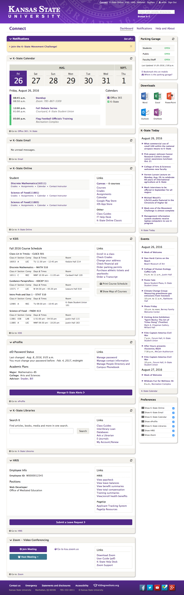

Connect is K-State’s interactive dashboard of commonly used Kansas State University services. The app allows users to quickly view highlighted details of the services available on a phone, tablet, or computer.

